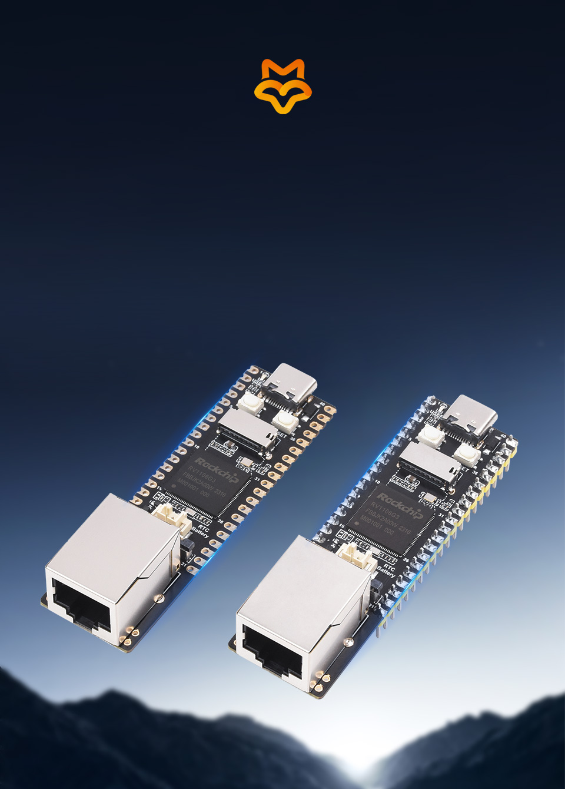
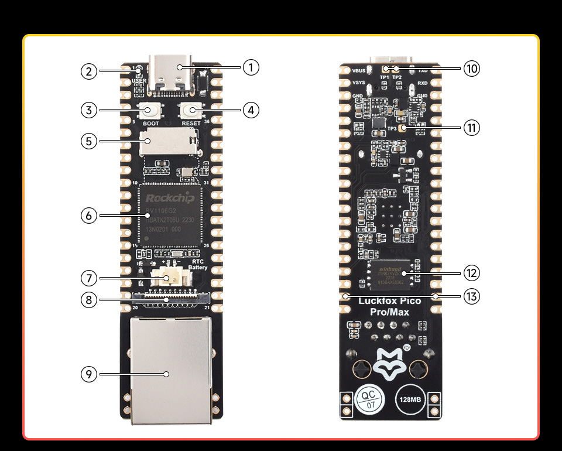
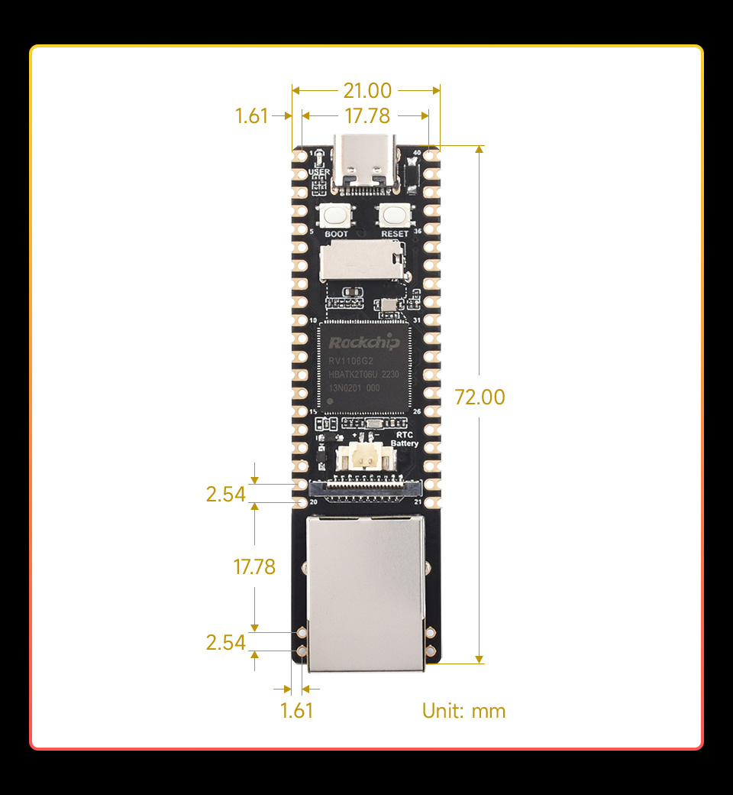

# Luckfox Pico Pro Max 4G/WiFi 遥控小车

一台**单核 Linux 小车**的完整实现：摄像头图传、网页遥控、失控保护，
以及本项目最核心的部分 —— **用 ESP32-C5 当 SPI 从机做的内核态网络隧道**。

```
        ┌──────────────┐   WiFi    ┌────────────┐   SPI 20MHz   ┌─────────────────┐
        │  浏览器/手机  │ ────────► │  ESP32-C5  │ ◄───────────► │  Luckfox RV1106 │
        │  控制 + 图传  │           │  WiFi 桥   │  4096B 帧     │  单核 Cortex-A7 │
        └──────────────┘           │ + NAPT     │               │  spitun.ko      │
                                   └────────────┘               └─────────────────┘
```

板子本身在 WiFi 网段上**没有 IP** —— 它和外界唯一的通路就是那条 SPI 隧道。

---

## 界面

网页控制端（PC / 手机同一套，自适应）：


| 手机端 | 遥测与调试面板 |
|---|---|
|  |  |

界面里几个**为排查问题专门做**的元素（都是踩坑之后加的）：

* **`已发 N 条 · 距上次发出 xxms · RTT xxms`** —— 一眼看出"页面到底有没有在发指令"。
  这个数一直变大 = 页面卡住了；板子 1 秒收不到指令就会自动停车。
* **失效保护告警** —— 板子统计"指令到达间隔超过失控超时的比例"（误停率），
  超过 5% 时页面变红提示"超时过短，正在误停"。
* 图传走 WebRTC（低延迟），带宽吃紧时自动可切档位。

## 实车

| 整车 | 侧面 | 接线 |
|---|---|---|
|  |  |  |


---

## 为什么值得一看

这个项目里大部分代码不是"写出来"的，是**被单核 + 无重传 + 无 IP 通路这三重约束逼出来的**。
每个非显然的设计决定，代码注释里都记了**实测数据和踩过的坑**。

### 1. SPI 隧道做在内核里（`spitun_kmod/spitun.c`）

原来跑在用户态 Python（`spinet.py`），在单核 A7 上**忙轮询吃掉 25~36% CPU**，
把视频编码饿死。搬到内核后 CPU 占用降到 ~0%，帧率恢复。

- **每帧打包多个 IP 报文**：帧固定 4096B，而一次 exchange 要 3.1ms。
  只装一个 1350B 报文等于把 2/3 的帧浪费掉 → 打包 3 个，吞吐 ×2.5
- **小包优先队列**：控制指令/ACK 只有几十字节，不该排在 1350B 的视频包后面
- **帧级重传**：SPI 从机"武装窗口"撞上主机传输就会丢整帧（实测稳态 0.6~4%，
  开机阶段突发 **30%**）。隧道层没有重传 → 丢一帧 = 报文永久消失 →
  只能等 TCP 的 **RTO ≥200ms**。改成在**最底层立刻重发**（代价 ~3ms），
  开机阶段的失败**全部被补回**（`retry=5, retry_ok=5, fail=0`）
- **重传预算**：C5 整机不在线时每帧都会失败，无脑重试等于在主循环空转
  （实测 6183 次白重试）→ 加预算，用完就交给上层

### 2. 回程路由用**源地址策略路由**，不写死客户端 IP

板子有两条路（eth0 网线 / spitun0 隧道），回包走错就彻底失联。
原来写死 `192.168.3.64`，客户端 DHCP 一变（→ `.65`）控制就**完全没反应**，
而板子侧看什么都正常（C5 在线、隧道通、CPU 空闲、本地 API 12ms）。

现在按**源地址**分流，不需要知道客户端是谁：

```sh
ip rule add from 10.77.0.2 lookup 100 pref 100
ip route replace 192.168.3.0/24 dev spitun0 src 10.77.0.2 table 100
```

> 走过弯路：想在 web_server 里"每请求自愈"补路由 —— **无效**。
> SYN-ACK 是内核发的，没路由连握手都完不成，处理器根本不会被调用。

### 3. 失控保护（deadman）+ 前导沿心跳

网页曾经"只在数值变化时才发指令"，按住不动时板子 1 秒收不到 → 停车 →
表现为"车走走停停"。现在**输入一变立刻发 + 100ms 心跳 + 请求超时**，
并且超时可配置、页面能自检版本（改了没生效会自动重载）。

### 4. 单核上的每一毫秒都要算

注释里能看到大量"这里曾经吃掉多少 CPU"的记录：软件 PWM 从 1kHz 降到 250Hz、
遥测采集从 5Hz 降回 1Hz（`read_adc_mv` 单次 264ms，5Hz 就是 132% CPU，
物理上跑不完）、Nagle 关闭省下 36ms/条指令……

---

## 目录

| 路径 | 说明 |
|---|---|
| `spitun_kmod/spitun.c` | **板子侧 SPI 隧道内核模块**（含重传/打包/优先队列） |
| `spi_tunnel_c3/main/` | **ESP32-C5 侧固件**（SPI 从机 + WiFi + NAPT）|
| `car/` | 板子侧应用：`web_server.py`、`car_motor.py`、`index.html`、`video_ctl.py`、`cam_ctl.py` |
| `car/S22spinet` 等 | init.d 脚本（隧道/网页/图传/看门狗）|
| `hw_spi_v1.dts` / `hw_spi.dtbo` | 启用 SPI0 与 `spitun` 节点匹配的设备树 |
| `wsl_*.sh` | 交叉编译内核/模块的脚本 |
| `PROGRESS.md` | **完整的开发日志**（每轮的问题、数据、结论、弯路）|
| `SPI_LATENCY_ANALYSIS.md` | SPI 隧道延迟的实测分析（为什么是"每帧固定开销"限制吞吐）|
| `BACKUP_README.md` | 两代备份（用户态 / 内核态）与恢复步骤 |

---

## 关键实测数据

| 指标 | 数值 |
|---|---|
| SPI 单帧 | 3.10 ms（纯线上 1.64ms @20MHz，**固定开销 1.46ms**）|
| 隧道吞吐 | 修复前 3.42 Mbps → **9.21 Mbps** |
| 控制延迟（满载）| p50 95ms → **p50 36ms / p90 61ms / max 78ms** |
| 控制丢包（满载）| 有长尾 → **200/200 到达，0 丢包** |
| 帧失败（开机阶段）| 累积上万 → **fail=0**（重传全部补回）|
| 空载控制 | p50 **24ms**，本地回环 12ms |

---

## 硬件

| 部件 | 型号 |
|---|---|
| 主控 | Luckfox Pico Pro Max（RV1106，单核 Cortex-A7，128MB）|
| WiFi 桥 | ESP32-C5（SPI 从机 + NAPT）|
| 摄像头 | SC3336 3MP（CSI，H.264 编码由 rkipc 完成）|
| 底盘 | 4WD 麦克纳姆轮 + TB6612 ×2（MD240A）|
| 图传 | rkipc（RTSP）→ mediamtx（WebRTC / HLS）|

> ⚠️ **电机必须独立供电**。用 USB/调试线带电机 → 启动电流拉垮供电 →
> 板子/C5 欠压 → 隧道断 2 秒。C5 的串口日志里有确凿证据：
> `E BOD: Brownout detector was triggered`

---

## 配置

真实凭据**不在仓库里**。拷贝模板再填：

```sh
cp car_config.example.json car/car_config.json   # 填 MQTT broker/密码、引脚
cp spi_tunnel_c3/main/main.c.example spi_tunnel_c3/main/main.c  # 填 WiFi SSID/密码
```

`.gitignore` 已排除 `car_config.json`、`main.c`、`sdkconfig`、私钥等。

---

## 编译

**内核模块**（需要与运行内核同源的 SDK 与工具链）：

```sh
export PATH=$SDK/tools/linux/toolchain/arm-rockchip830-linux-uclibcgnueabihf/bin:$PATH
cd spitun_kmod && make        # 产物 spitun.ko, vermagic 必须与板子内核一致
```

**ESP32-C5 固件**：标准 ESP-IDF 工程，`idf.py build flash`。

---

## 许可

仅供学习参考。涉及真实硬件，请自行评估安全风险 —— **遥控车务必先做好失控保护**。
