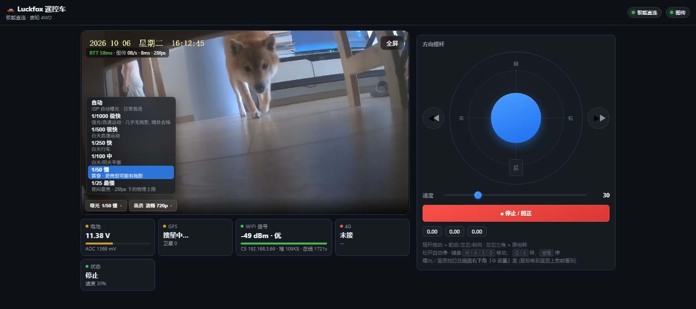
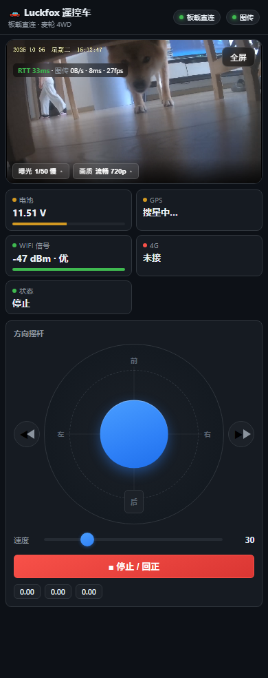
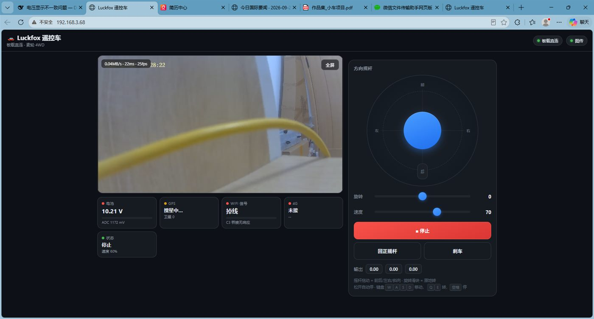

# Luckfox Pico Pro Max 遥控小车

一台**单核 Linux 小车**的完整实现：摄像头图传、网页遥控、失控保护，
以及本项目最核心的部分 —— **用 ESP32-C5 当 SPI 从机做的内核态网络隧道**。

```
        ┌──────────────┐   WiFi    ┌────────────┐   SPI 20MHz   ┌─────────────────┐
        │  浏览器/手机  │ ────────► │  ESP32-C5  │ ◄───────────► │  Luckfox RV1106 │
        │  控制 + 图传  │           │  WiFi 桥   │  4096B 帧     │  单核 Cortex-A7 │
        └──────────────┘           │ + NAPT     │               │  spitun.ko      │
                                   └────────────┘               └─────────────────┘
```

板子本身在 WiFi 网段上**没有 IP** —— 它和外界唯一的通路就是那条 SPI 隧道。

---

## 目录结构

```
firmware/c5-tunnel/     ESP32-C5 侧固件 (SPI 从机 + WiFi + NAPT)
driver/spitun.c         板子侧内核模块: SPI 隧道 (核心)
board/
  app/                  板子侧应用 (网页服务 / 电机 / 图传 / 摄像头 / GPS)
  init.d/               开机启动链 (文件名与板子上**完全一致**, 见下表)
  config/               配置模板 (car_config / mediamtx)
  dts/                  SPI0 + spitun 节点的设备树 overlay
tools/
  build/                交叉编译 (内核 / 内核模块)
  deploy/               部署 (整机部署 / 模块热替换 / 只刷 boot)
  diagnose/             测量与观测 (控制延迟 / 失控保护 / SPI 丢帧 / TCP 重传)
docs/                   文档与截图
```

### 启动链（`board/init.d/`）

脚本之间是**按名字互相调用**的（例如 `S24spinet_wd` 会调 `/etc/init.d/S22spinet restart`），
所以仓库里的文件名和板子上**逐一对应、不做美化** —— 拷过去就能直接用，
也避免"仓库名 ≠ 设备名"引发静默失效。用途写在每个文件头的 `# 用途:` 注释里：

| 文件 | 用途 |
|---|---|
| `S20lo` | `lo` 回环接口（板载服务要访问 127.0.0.1）|
| `S21wdt` | 硬件看门狗（内核卡死时自动复位）|
| `S22spinet` | **SPI 隧道接口**：给 `spitun0` 配地址 + 装回程策略路由 |
| `S23web` | 板载网页控制服务（`web_server.py`，监听 :80）|
| `S24spinet_wd` | **隧道看门狗**：假死/模块丢失时自动重启并撤/补回程路由 |
| `S25mediamtx` | 图传服务（拉 rkipc 的 RTSP，出 WebRTC/HLS）|

> **时钟**：这台板子**故意不设时区**，也没有任何校时脚本 ——
> `/etc/TZ`、`/etc/localtime`、`S99rtcinit`、`S49ntp` 都被移除了。
> `RTC == 系统时钟 == 北京时间读数`，零换算，所以摄像头 OSD 水印直接就是对的。
> 原因和证据见 [`docs/TIME.md`](docs/TIME.md)（**修了五轮才找到根因，很值得一看**）。

> 注：`S22spinet` / `S24spinet_wd` 里的 "spinet" 是**历史名字**（隧道曾经是用户态
> Python 进程 `spinet.py`）。现在隧道在内核里，这两个脚本只负责配接口和看门狗。
> 名字保留不改，是因为设备上就是这个名字，改了反而对不上。

| 关心什么 | 看哪里 |
|---|---|
| 隧道怎么做的、为什么这么做 | `driver/spitun.c` + `docs/SPI_TUNNEL_DESIGN.md` |
| 延迟瓶颈的实测分析 | `docs/SPI_LATENCY_ANALYSIS.md` |
| **时钟为什么故意不设时区** | `docs/TIME.md` |
| **部署"没生效"先查什么** | `docs/USERDATA_SPACE.md`（`/userdata` 只有 2.2MB）|
| 完整的开发过程与踩坑记录 | `docs/PROGRESS.md` |
| 硬件怎么接 | `docs/WIRING.md` |
| 板上怎么部署 | `board/init.d/` + `tools/deploy/` |
| 出问题怎么查 | `docs/ISSUES.md` + `tools/diagnose/` |

---

## 界面

网页控制端（PC / 手机同一套，自适应）：



| 手机端 | 遥测与调试面板 |
|---|---|
|  |  |

画面上的控件做成**视频播放器风格**的 OSD（悬停/点画面才浮现），刻意做得小而精致，
不喧宾夺主：

* **左上角 HUD**：`RTT xxms · 图传 …`，紧贴在摄像头水印下方（两者错开不重叠）。
  RTT 是控制指令的真实往返，一眼看出控制链路通不通。
* **底部控制条**：点「曝光 1/1000」「画质 720p」各自弹出**上弹菜单**（半透明，
  能透出背后的画面），选完即关。
* **失效保护告警** —— 板子统计"指令到达间隔超过失控超时的比例"（误停率），
  超过 5% 时页面变红提示"超时过短，正在误停"。

### 操作件：能按的就不拖

面板上只留**一个**滑条（速度）和**一个**大按钮：

* **原地转**：贴在转盘**左右两侧的两个三角按钮**。
  原来"旋转"是根滑条 —— 开车时得先拖到某个位置再保持住，单手很难做到。
  改成**按住三角就转、一松手立刻回正**，既是手感改进，也是天然的失效保护：
  手一松车就不转了。转向量在约 700ms 内平滑推到 ±70%（避免瞬间满舵把车甩出去），
  按住期间按钮变蓝。
* **「■ 停止 / 回正」是一个按钮，两件事一起做**。原来是"停止 / 回正摇杆 / 刹车"
  三个按钮，但开车时"停"和"回正"永远是同一个动作（急停之后摇杆当然要回中），
  分成两个按钮只会让人在慌乱时点错。这一个按钮同时：归零运动矢量 →
  **清空键盘按键状态** → 把摇杆圆点视觉弹回中心 → 停掉原地转并发 `stop`。

> **两个踩过的坑（都实测复现过）**：
>
> 1. **`setPointerCapture` 会让 `pointerleave` 永不触发**。三角按钮一开始加了
>    capture，结果"按住后把指针拖到别处，车还在原地转"——对遥控车是危险的。
>    现在不 capture，把 `pointerup/pointercancel` 绑在 window 上，并用
>    `pointerleave` 兜底。
> 2. **停止按钮必须清空键盘按键状态**。否则"按住 `W` 的同时点停止"，
>    车会**立刻又走起来**（`keys` 里还留着 `w`，下一次 `keyApply` 又把它推回去）。

> **曝光/画质为什么也是"档位"而不是滑条**：ISP 参数在 rkipc 启动时就被固化，
> 改任何摄像头参数都必须**重启 rkipc（约 20 秒画面中断）**——这是硬限制。
> 所以做成离散档位，而不是拖一下就发一次的滑条。
> 曝光档位实测有效（1/1000 → ISP exposure=41，1/25 → 1624，单调可控）；
> 而直接写 `/dev/v4l-subdev2` 的"实时滑条"在这块板子上**完全无效**，
> 写进去 800ms 后被 ISP 自动曝光覆盖掉，已删除。

---

## 为什么值得一看

这个项目里大部分代码不是"写出来"的，是**被单核 + 无重传 + 无 IP 通路这三重约束逼出来的**。
每个非显然的设计决定，代码注释里都记了**实测数据和踩过的坑**。

### 1. SPI 隧道做在内核里（`driver/spitun.c`）

原来跑在用户态 Python（`spinet.py`），在单核 A7 上**忙轮询吃掉 25~36% CPU**，
把视频编码饿死。搬到内核后 CPU 占用降到 ~0%，帧率恢复。

- **每帧打包多个 IP 报文**：帧固定 4096B，而一次 exchange 要 3.1ms。
  只装一个 1350B 报文等于把 2/3 的帧浪费掉 → 打包 3 个，吞吐 ×2.5
- **小包优先队列**：控制指令/ACK 只有几十字节，不该排在 1350B 的视频包后面
- **帧级重传**：SPI 从机"武装窗口"撞上主机传输就会丢整帧（实测稳态 0.6~4%，
  开机阶段突发 **30%**）。隧道层没有重传 → 丢一帧 = 报文永久消失 →
  只能等 TCP 的 **RTO ≥200ms**。改成在**最底层立刻重发**（代价 ~3ms），
  开机阶段的失败**全部被补回**（`retry=5, retry_ok=5, fail=0`）
- **重传预算**：C5 整机不在线时每帧都会失败，无脑重试等于在主循环空转
  （实测 6183 次白重试）→ 加预算，用完就交给上层

### 2. 回程路由用**源地址策略路由**，不写死客户端 IP

板子有两条路（eth0 网线 / spitun0 隧道），回包走错就彻底失联。
原来写死 `192.168.3.64`，客户端 DHCP 一变（→ `.65`）控制就**完全没反应**，
而板子侧看什么都正常（C5 在线、隧道通、CPU 空闲、本地 API 12ms）。

现在按**源地址**分流，不需要知道客户端是谁：

```sh
ip rule add from 10.77.0.2 lookup 100 pref 100
ip route replace 192.168.3.0/24 dev spitun0 src 10.77.0.2 table 100
```

> 走过弯路：想在 web_server 里"每请求自愈"补路由 —— **无效**。
> SYN-ACK 是内核发的，没路由连握手都完不成，处理器根本不会被调用。

### 3. 失控保护（deadman）+ 前导沿心跳

网页曾经"只在数值变化时才发指令"，按住不动时板子收不到心跳 → 停车 →
表现为"车走走停停"。现在**输入一变立刻发 + 100ms 心跳 + 请求超时**，
并且超时可配置（`board/config/board/config/car_config.example.json` 的 `failsafe_s`）、
页面能自检版本（改了没生效会自动重载）。

### 4. 单核上的每一毫秒都要算

注释里能看到大量"这里曾经吃掉多少 CPU"的记录：软件 PWM 从 1kHz 降到 250Hz、
遥测采集从 5Hz 降回 1Hz（`read_adc_mv` 单次 264ms，5Hz 就是 132% CPU，
物理上跑不完）、Nagle 关闭省下 36ms/条指令……

---

## 关键实测数据

| 指标 | 数值 |
|---|---|
| SPI 单帧 | 3.10 ms（纯线上 1.64ms @20MHz，**固定开销 1.46ms**）|
| 隧道吞吐 | 修复前 3.42 Mbps → **9.21 Mbps** |
| 控制延迟（满载）| p50 95ms → **p50 36ms / p90 61ms / max 78ms** |
| 控制丢包（满载）| 有长尾 → **200/200 到达，0 丢包** |
| 帧失败（开机阶段）| 累积上万 → **fail=0**（重传全部补回）|
| 空载控制 | p50 **24ms**，本地回环 12ms |

---

## 硬件

| 部件 | 型号 |
|---|---|
| 主控 | Luckfox Pico Pro Max（RV1106，单核 Cortex-A7，128MB）|
| WiFi 桥 | ESP32-C5（SPI 从机 + NAPT）|
| 摄像头 | SC3336 3MP（CSI，H.264 编码由 rkipc 完成）|
| 底盘 | 4WD 麦克纳姆轮 + TB6612 ×2（MD240A）|
| 图传 | rkipc（RTSP）→ mediamtx（WebRTC / HLS）|

> ⚠️ **电机必须独立供电**。用 USB/调试线带电机 → 启动电流拉垮供电 →
> 板子/C5 欠压 → 隧道断 2 秒。C5 的串口日志里有确凿证据：
> `E BOD: Brownout detector was triggered`

---

## 部署

**1. 配置**（真实凭据不在仓库里，用模板填）：

```sh
cp board/config/board/config/car_config.example.json /userdata/car/car_config.json
# 填 MQTT broker / 密码 / 引脚
cp firmware/c5-tunnel/main.c.example firmware/c5-tunnel/main.c
# 填 WiFi SSID / 密码, 然后用 idf.py build flash
```

**2. 板子侧**：

```sh
# 应用
scp board/app/* root@<板子IP>:/userdata/car/
# 启动链 (注意: init.d 里的文件名必须与板上一致)
scp board/init.d/S* root@<板子IP>:/etc/init.d/
ssh root@<板子IP> "chmod 755 /etc/init.d/S*; reboot"
# 设备树 overlay
scp board/dts/spi0-tunnel.dts ...     # 编译成 .dtbo 后由 hwcfg 加载
```

**3. 内核模块**（必须与运行内核同源编译）：

```sh
tools/build/build-spitun.sh        # WSL 里跑, 产物 spitun.ko
tools/deploy/reload-tunnel.sh      # 热替换 (会断网几秒, 自动回滚)
```

---

## 诊断工具

| 工具 | 用途 |
|---|---|
| `tools/diagnose/measure-control-latency.sh` | 控制往返延迟分解测量 |
| `tools/diagnose/test-failsafe.sh` | 失控保护验证（覆盖"误停"与"漏停"）|
| `tools/diagnose/watch-failsafe.py` | 板子侧观测失控触发与 C5 复位 |
| `tools/diagnose/watch-spi-loss.py` | SPI 帧失败率 / 重传观测 |
| `tools/diagnose/tcp-retransmits.py` | TCP 重传计数（丢包的间接证据）|

---

## 许可

仅供学习参考。涉及真实硬件，请自行评估安全风险 —— **遥控车务必先做好失控保护**。
